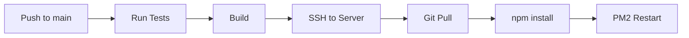
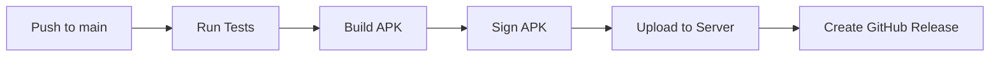

# 🚀 CI/CD Configuration for МастерПрофи

## Обзор

Проект использует **GitHub Actions** для автоматизации тестирования, сборки и деплоя всех компонентов.

## 📋 Настроенные Workflow

### 1. **Backend CI/CD** (`backend-ci.yml`)
- **Триггеры**: Push/PR в `backend/` на ветки `main`, `develop`
- **Этапы**:
  - ✅ Тестирование (npm test)
  - ✅ Проверка линтером
  - ✅ Сборка приложения
  - 🚀 Автоматический деплой на сервер (только main)

### 2. **Client App CI/CD** (`client-app-ci.yml`)
- **Триггеры**: Push/PR в `ClientApp/` на ветки `main`, `develop`
- **Этапы**:
  - ✅ Lint Kotlin кода (ktlint)
  - ✅ Unit тесты
  - 📦 Сборка Debug APK (develop)
  - 🚀 Сборка и публикация Release APK (main)
  - 📤 Загрузка APK на сервер обновлений

### 3. **Master App CI/CD** (`master-app-ci.yml`)
- **Триггеры**: Push/PR в `app/` на ветки `main`, `develop`
- **Этапы**:
  - ✅ Lint Kotlin кода
  - ✅ Unit тесты
  - 📦 Сборка Debug/Release APK
  - 🚀 Автоматическая публикация релизов

### 4. **Code Quality** (`code-quality.yml`)
- **Триггеры**: Все Push/PR
- **Проверки**:
  - 🔒 Сканирование уязвимостей (Trivy)
  - 📦 Проверка зависимостей (npm audit)
  - 📝 Проверка документации

## 🔐 Необходимые GitHub Secrets

Для работы CI/CD добавьте следующие секреты в репозиторий:

```bash
# Server SSH
SERVER_HOST=212.74.227.208
SERVER_USER=root
SSH_PRIVATE_KEY=<содержимое приватного SSH ключа>

# Client App Signing
KEYSTORE_BASE64=<base64 закодированный keystore>
KEYSTORE_PASSWORD=<пароль keystore>
KEY_ALIAS=<алиас ключа>
KEY_PASSWORD=<пароль ключа>

# Master App Signing
MASTER_KEYSTORE_BASE64=<base64 закодированный keystore>
MASTER_KEYSTORE_PASSWORD=<пароль keystore>
MASTER_KEY_ALIAS=<алиас ключа>
MASTER_KEY_PASSWORD=<пароль ключа>
```

## 📝 Как добавить секреты

1. Перейдите в: **Settings** → **Secrets and variables** → **Actions**
2. Нажмите **New repository secret**
3. Добавьте секрет по имени и значению

### Генерация KEYSTORE_BASE64

```bash
# Создать keystore
keytool -genkey -v -keystore release.keystore -alias my-key-alias -keyalg RSA -keysize 2048 -validity 10000

# Конвертировать в base64
base64 release.keystore | tr -d '\n'
```

### Генерация SSH ключа

```bash
# На локальной машине
ssh-keygen -t rsa -b 4096 -C "github-actions"

# Добавить публичный ключ на сервер
ssh-copy-id -i ~/.ssh/id_rsa.pub root@212.74.227.208

# Использовать приватный ключ как SSH_PRIVATE_KEY
cat ~/.ssh/id_rsa
```

## 🎯 Процесс Деплоя

### Backend (Автоматический)



### Android Apps



## 📊 Мониторинг

- **GitHub Actions Tab**: Просмотр всех workflow запусков
- **Security Tab**: Результаты сканирования уязвимостей
- **Releases Tab**: Опубликованные APK файлы

## 🔧 Локальная отладка Workflow

Используйте [act](https://github.com/nektos/act) для локального тестирования:

```bash
# Установка
brew install act  # macOS
choco install act # Windows

# Запуск workflow локально
act -j test  # Только тесты
act push     # Симуляция push события
```

## 📈 Метрики

После каждого деплоя:
- ✅ Время сборки: ~5-10 минут
- ✅ Время деплоя backend: ~2 минуты
- ✅ Размер APK: ~15-25 MB

## 🐛 Troubleshooting

### Backend деплой не работает

```bash
# Проверить SSH доступ
ssh -i ~/.ssh/id_rsa root@212.74.227.208

# Проверить PM2 процессы
pm2 list
pm2 logs masterprofi-backend
```

### APK сборка падает

```bash
# Локальная сборка для отладки
cd ClientApp
./gradlew assembleRelease --stacktrace
```

### Тесты не проходят

```bash
# Backend
cd backend
npm test -- --verbose

# Android
cd ClientApp
./gradlew test --info
```

## 📚 Дополнительные ресурсы

- [GitHub Actions Documentation](https://docs.github.com/en/actions)
- [Gradle Build Documentation](https://docs.gradle.org/)
- [PM2 Documentation](https://pm2.keymetrics.io/)

---

**Последнее обновление**: 23.12.2025
