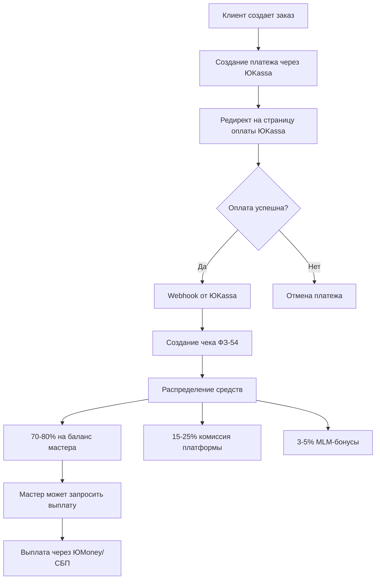

# 📋 План интеграции платежных систем (ЮKassa + ЮMoney)

## 🎯 Цель
Интегрировать ЮKassa для приема платежей от клиентов и ЮMoney для выплат мастерам согласно рекомендациям.

---

## ✅ Текущее состояние

### Что уже есть:
- ✅ Базовая структура платежей (`payments` таблица)
- ✅ Система кошелька мастера (`master_transactions`)
- ✅ Пополнение кошелька мастера
- ✅ Расчет комиссий платформы (15% basic, 10% premium)
- ✅ TODO комментарий про yookassa в коде

### Что нужно добавить:
- ❌ Интеграция с ЮKassa API
- ❌ Интеграция с ЮMoney API для выплат
- ❌ Webhook обработчик для ЮKassa
- ❌ Онлайн-касса (ФЗ-54 чеки)
- ❌ MLM-выплаты через ЮMoney

---

## 📦 Шаг 1: Установка зависимостей

```bash
cd backend
npm install @a2seven/yoo-checkout
```

---

## 🔧 Шаг 2: Создание сервисов

### 2.1. Сервис ЮKassa (`services/yookassa-service.js`)
- Создание платежей
- Обработка webhook'ов
- Проверка статуса платежей
- Генерация чеков (ФЗ-54)

### 2.2. Сервис ЮMoney (`services/yoomoney-service.js`)
- Выплаты мастерам
- Проверка статуса выплат
- История выплат

### 2.3. MLM-сервис выплат (`services/mlm-payout-service.js`)
- Расчет комиссий по уровням MLM
- Автоматические выплаты через ЮMoney

---

## 🗄️ Шаг 3: Обновление схемы БД

Добавить в `payments`:
- `yookassa_payment_id` - ID платежа в ЮKassa
- `receipt_id` - ID чека онлайн-кассы
- `receipt_data` - JSON данные чека

Добавить в `master_transactions`:
- `yoomoney_payout_id` - ID выплаты в ЮMoney
- `payout_status` - статус выплаты (pending/processing/completed/failed)

---

## 🚀 Шаг 4: Реализация API endpoints

### 4.1. Создание платежа через ЮKassa
```
POST /api/payments/create-yookassa
Body: { orderId, amount, returnUrl }
Response: { paymentUrl, paymentId }
```

### 4.2. Webhook от ЮKassa
```
POST /api/payments/webhook/yookassa
Body: Webhook данные от ЮKassa
```

### 4.3. Выплата мастеру через ЮMoney
```
POST /api/masters/wallet/payout-yoomoney
Body: { amount, masterId }
Response: { payoutId, status }
```

---

## 🔐 Шаг 5: Переменные окружения

Добавить в `.env`:
```env
YOOKASSA_SHOP_ID=your_shop_id
YOOKASSA_SECRET_KEY=your_secret_key
YOOMONEY_CLIENT_ID=your_client_id
YOOMONEY_CLIENT_SECRET=your_client_secret
YOOMONEY_ACCESS_TOKEN=your_access_token

# Онлайн-касса (ФЗ-54)
OFD_PROVIDER=atol|online-kassa.ru
OFD_API_KEY=your_ofd_key
OFD_INN=your_inn
OFD_PAYMENT_ADDRESS=your_payment_address
```

---

## 📊 Шаг 6: Схема работы



---

## 💰 Шаг 7: MLM-выплаты

При успешной оплате заказа:
1. Расчет комиссий по уровням MLM (3%, 2%, 1%)
2. Накопление на счетах участников MLM
3. Автоматическая выплата при достижении порога (например, 1000 ₽)
4. Или ручная выплата по запросу

---

## 📱 Шаг 8: Обновление Android приложения

- Добавить экран оплаты заказа
- Интеграция WebView для оплаты через ЮKassa
- Уведомления о статусе платежа
- История платежей в профиле клиента

---

## ⚠️ Юридические требования

- ✅ Онлайн-касса с чеками по ФЗ-54 (обязательно)
- ✅ PCI DSS compliance (ЮKassa обеспечивает)
- ✅ Согласие на обработку персональных данных
- ✅ Политика возвратов (7 дней для услуг)
- ✅ Оферта для клиентов

---

## 📅 Этапы реализации

1. **Этап 1** (1-2 дня): Установка зависимостей, создание сервисов ЮKassa
2. **Этап 2** (2-3 дня): Интеграция создания платежей и webhook'ов
3. **Этап 3** (1-2 дня): Интеграция ЮMoney для выплат
4. **Этап 4** (2-3 дня): MLM-выплаты
5. **Этап 5** (2-3 дня): Онлайн-касса (ФЗ-54)
6. **Этап 6** (1-2 дня): Тестирование и доработка

**Итого: ~10-15 дней**

---

## 🔄 Приоритет реализации

1. **Высокий приоритет:**
   - Интеграция ЮKassa для приема платежей
   - Webhook обработка
   - Выплаты мастерам через ЮMoney

2. **Средний приоритет:**
   - Онлайн-касса (ФЗ-54)
   - MLM-выплаты
   - UI для оплаты в приложении

3. **Низкий приоритет:**
   - Дополнительные платежные системы (СБП, Сбербанк)
   - Расширенная аналитика платежей


